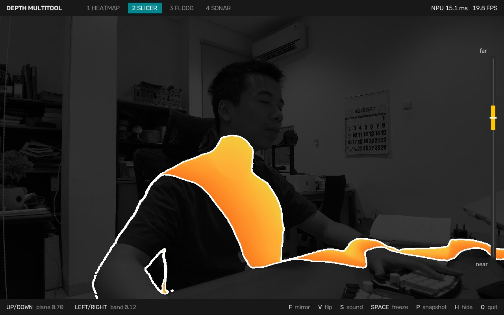
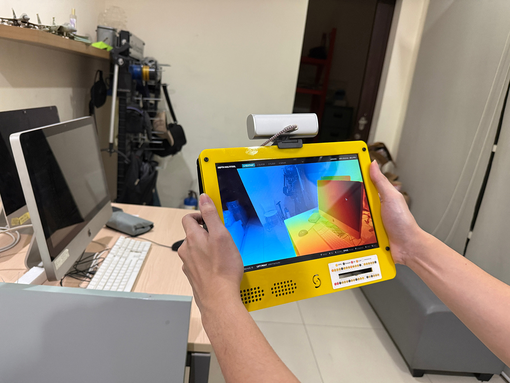
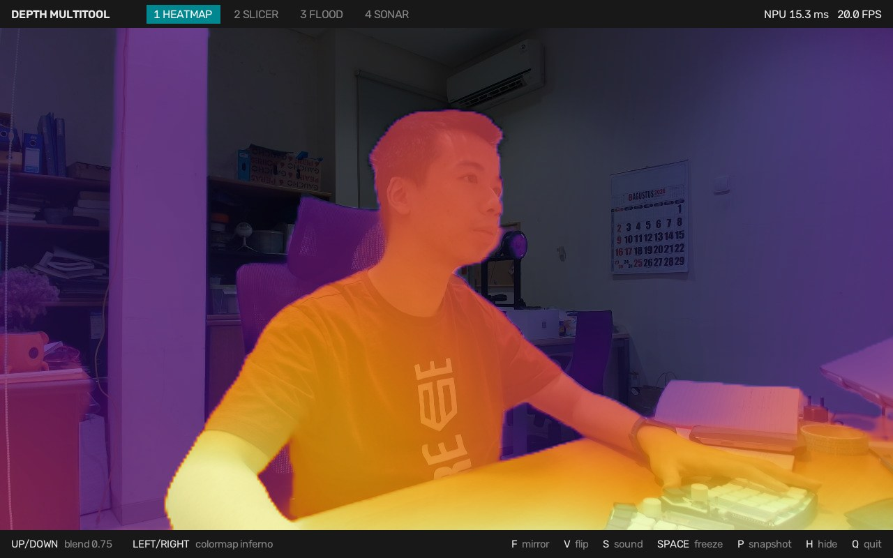
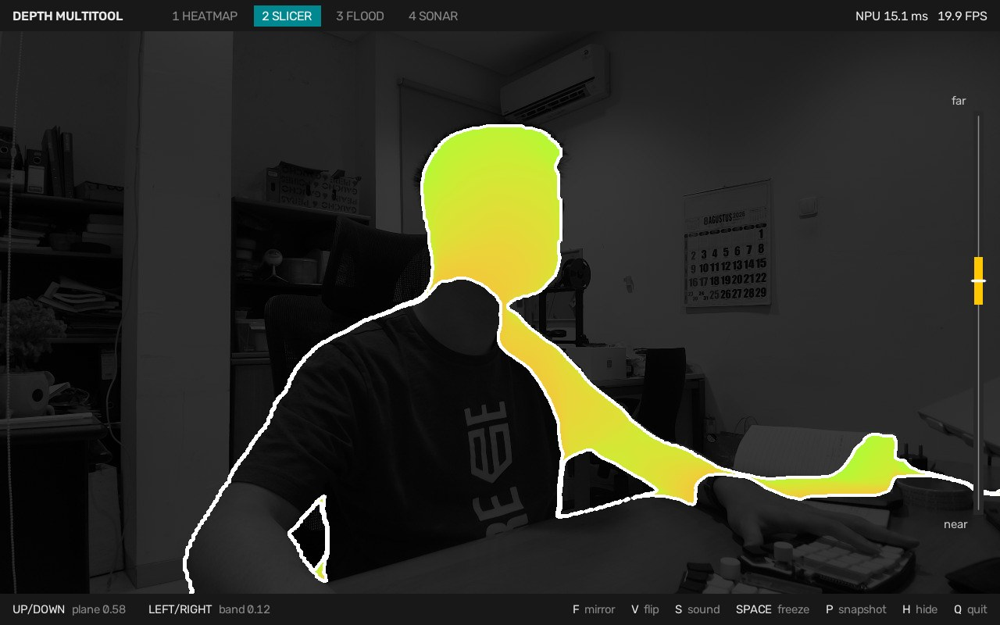
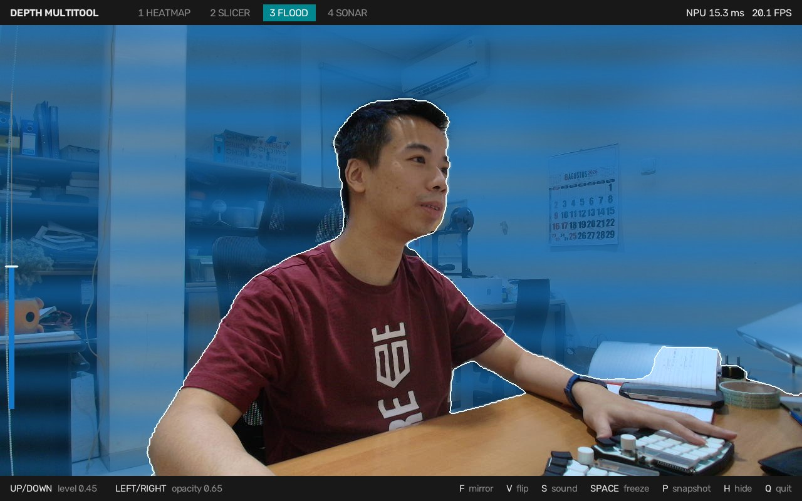
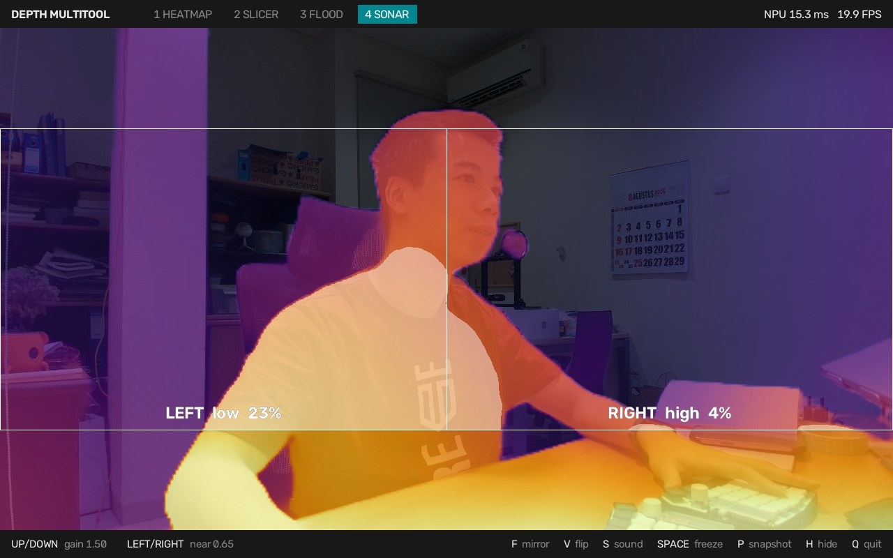
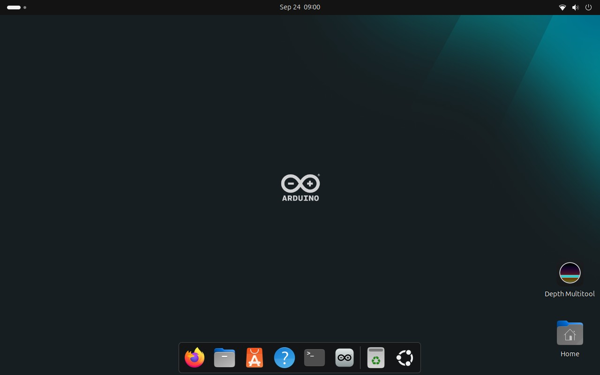
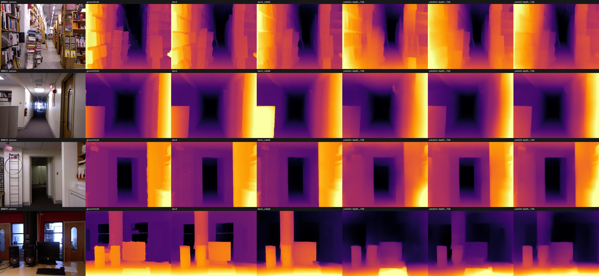

# Depth Multitool on the Arduino VENTUNO Q

One ordinary webcam, a depth model on the VENTUNO Q's NPU, and four ways to see how far away everything is. Double-click an icon and it runs fullscreen at 20 frames per second, from a power bank.



**Board:** Arduino VENTUNO Q
**Model:** Depth Anything V2 Small (Apache-2.0), running on the NPU
**Measured on the board:** 16 ms per frame on the NPU, 20 FPS on screen in every tool, 11.8 W for the board itself
<!-- SAM: add your meter's whole-setup figure (expected about 17 W) -->
**Difficulty:** Beginner, about 30 minutes

## Introduction

Close one eye and look around the room. You still know the mug is nearer than the door, and that you could reach the chair but not the wall. Your brain works it out from a single flat picture, using cues it has learned over a lifetime: how big things usually are, where they touch the floor, which one hides the other.

A camera has none of that. To it, every pixel is just a colour, and a photo of a hallway looks no different from a painting of one. So when robots and phones need distance, they add hardware: a second camera for stereo, an infrared projector, a LiDAR scanner.

Neural networks have now learned the one-eyed trick. Monocular depth models look at one ordinary image and estimate how far away every pixel is, and the good ones can pick a person out from the chair behind them. The catch has been compute. These models are vision transformers, the kind that normally wants a laptop GPU, not a small board that runs from a power bank.

This project puts one on the Arduino VENTUNO Q, feeds it a plain USB webcam, and turns what it sees into four tools you can play with at 20 frames per second.

<!-- SAM PHOTO 1 (hero): drop the file in assets/ and uncomment the line below. Staging in PHOTOS.md.

-->

## What it does

There is no depth sensor here. A USB webcam takes an ordinary picture, and Depth Anything V2, a neural network running on the VENTUNO Q's NPU, estimates how far away every pixel is from that picture alone. The app turns that estimate into four tools, one per number key.



**Heatmap** (key 1) shows distance as colour. Near is bright, far is dark, with the camera image blended underneath.



**Slicer** (key 2) lights up only what sits at one distance, like a slice through an MRI scan. The arrow keys sweep the slice through the room and change its thickness.



**Flood** (key 3) fills the room with virtual water from the back wall forward. Whatever is close stays dry.



**Sonar** (key 4) measures how crowded each side of the view is, and you can hear it through the display's speaker: low clicks for the left, high clicks for the right, faster as things get closer. Walk toward a wall and the clicks speed up; turn toward an open doorway and they stop.

<!-- SAM PHOTO 4 (sonar): drop the file in assets/ and uncomment the line below. Staging in PHOTOS.md.

-->

## Why the VENTUNO Q

Depth Anything V2 Small has 25 million parameters. The VENTUNO Q's Qualcomm Dragonwing NPU runs it in 16 ms, with every layer on the NPU. That leaves the eight CPU cores free to decode the camera, draw the tools and generate the sonar sound at the same time.

It is also a regular Ubuntu computer with a desktop, so the app is a Python program with an icon. And the board, the 10 inch screen and the camera all run from one USB-C power bank. The board has its own power monitor, which made it easy to tune for battery life: see How it works.

## Things used in this project

| Hardware | Qty |
|---|---|
| Arduino VENTUNO Q | 1 |
| 10.1 inch HDMI display, 1280×800, 12 V, with a built-in speaker | 1 |
| USB webcam (a Logitech MX Brio here; any UVC webcam that does 1280×720 MJPG) | 1 |
| USB keyboard | 1 |
| Optional, to run untethered: UGREEN Nexode PB724 power bank (12,000 mAh, 100 W), a USB-C PD trigger set to 12 V, and a 5.5×2.1 mm barrel Y-splitter to feed the board and the display from it | 1 each |

<!-- SAM: confirm the power wiring above matches what you actually used, and add the display's model name -->

<!-- SAM PHOTO 2 (parts): drop the file in assets/ and uncomment the line below. Staging in PHOTOS.md.

-->

**Software:** the Ubuntu 24.04 image the VENTUNO Q ships with, Qualcomm AI Runtime, LiteRT and OpenCV. Qualcomm AI Hub is only needed if you want to rebuild the model yourself.

## Build it

1. Set up the VENTUNO Q and connect the display, webcam and keyboard. <!-- SAM: link Arduino's official VENTUNO Q getting-started page -->

   <!-- SAM PHOTO 3 (setup): drop the file in assets/ and uncomment the line below. Staging in PHOTOS.md.
   
   -->

2. Open a terminal on the board and run:

   ```bash
   git clone https://github.com/SamuelAlexander/ventuno-q-depth-multitool.git ~/depth-multitool
   cd ~/depth-multitool
   ./install.sh
   ```

3. Double-click **Depth Multitool** on the desktop. It is live in about 4 seconds.



The installer makes the NPU available to ordinary programs, builds a Python environment, fetches the model, prepares it on the NPU once and creates the icon. The first of those is the one worth knowing about: the VENTUNO Q keeps its NPU libraries inside the Arduino App Lab containers, and one package from the preinstalled Qualcomm repository puts them where any Python program can load them.

## Controls

| Key | What it does |
|---|---|
| **1 2 3 4** | Heatmap, Slicer, Flood, Sonar (**Tab** cycles) |
| **Up / Down** | The tool's main setting: blend, slice position, water level, sonar gain |
| **Left / Right** | Its second setting: colormap, slice thickness, water opacity, near threshold |
| **F** | Mirror the picture, for when the camera faces you |
| **V** | Flip it upside down, if the camera is mounted that way |
| **S** | Sonar sound on or off |
| **Space** | Freeze the frame. The tools keep working on the frozen picture |
| **P** | Save a snapshot to Pictures |
| **H** | Hide the bars |
| **Q** or **Esc** | Quit |

The app remembers the last tool and the camera orientation between launches.

## How it works

Three threads share the work. One reads the camera, one runs the model on the NPU, and the main thread draws. While the tools draw one frame, the NPU is already working on the next, so drawing never adds to the frame time.

The app is tuned for a battery. The NPU can run this model at 30 frames per second, but the board then draws 15.2 W. Capped at 20 frames per second, with the NPU in its balanced power mode and the webcam asked for only 20 frames, it draws 11.8 W, measured on the board's own power monitor.

Preparing a model for the NPU takes about 13 seconds, so the installer does it once and the delegate caches the result on disk. Every launch after that loads the prepared model in under half a second.

Mirroring and flipping happen before the model sees the picture. That matters for the flip: depth models expect the floor at the bottom of the image, and an upside-down frame gives a worse estimate.

## The model

The app runs Depth Anything V2 Small in full float precision at a 336×252 input. Two findings shaped that. The Qualcomm NPU delegate's default setting keeps the NPU at low clocks: at a 336×252 input the model took 58 ms per frame by default and 12.7 ms with the delegate's sustained high performance mode, a single option when the model is loaded. And for this vision transformer, a smaller input made it faster more cheaply than the usual 8-bit quantization: fewer image patches cut the attention cost faster than the pixel count fell, and staying in float avoided quantization's artifacts, including a flattened near field.

Ultralytics' YOLO26-depth was tested too. It is faster, but scored against the NYU Depth V2 benchmark its slices matched the true surfaces far less well (16.2% overlap against 24.4% for the input used here), and the Slicer depends on exactly that.



To rebuild the model, run `research/export_model.py` on any computer with a free Qualcomm AI Hub account.

## Going further

This project uses only the VENTUNO Q's Linux side. Its STM32 microcontroller is still free: physical knobs, buttons or vibration motors could talk to the app through Arduino's Router Bridge. [BOARD.md](BOARD.md) collects what we learned about the board while building this.

## License

Apache-2.0. Depth Anything V2 Small is Apache-2.0.

<!-- SAM: confirm the licence before publishing -->
